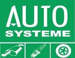
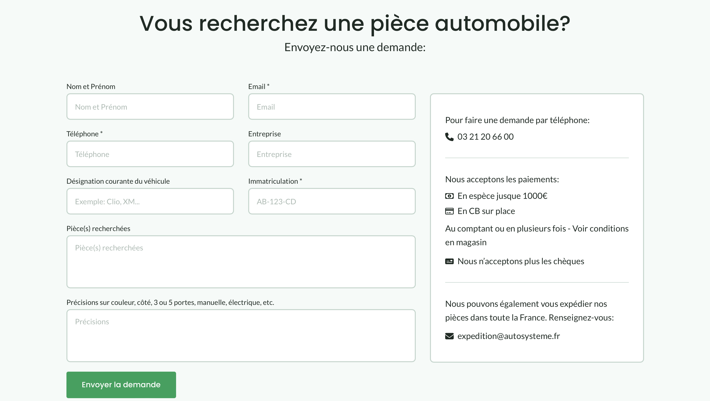

# Auto Systeme 

Ce projet a été créé pour présenter une casse automobile. Il est encore en construction. 🛠️

<div style="display: flex; width: '100%'; gap: 20px;">
    
    
</div>

## Technologies utilisées

- React.js
- React Router DOM
- Javascript
- Sass

## Installation

```
git clone https://github.com/Nina-petit/auto-systeme.git
cd auto-systeme
npm install
npm start
```

## Fonctionnalités à venir

- Sur la page d'accueil, un formulaire permettra à l'utilisateur.ice d'entrer sa plaque d'immatriculation, ce qui permettra de détecter à quel type de véhicule elle correspond, pour ensuite voir les pièces détachées actuellement disponibles pour ce véhicule.
- Sur la page Recherche de pièces et Nos véhicules à vendre, intégration d'un iFrame du site web Opisto, qui permettra de trouver et d'acheter en ligne les pièces et véhicules actuellement vendues par Auto Systeme.

## Contact et autres informations

- [Mon site personnel avec portfolio](https://nina-petit.herokuapp.com)
- [GitHub](https://www.linkedin.com/in/nina-petit-80b3b2190/)
- [LinkedIn](https://www.linkedin.com/in/nina-petit-80b3b2190/)